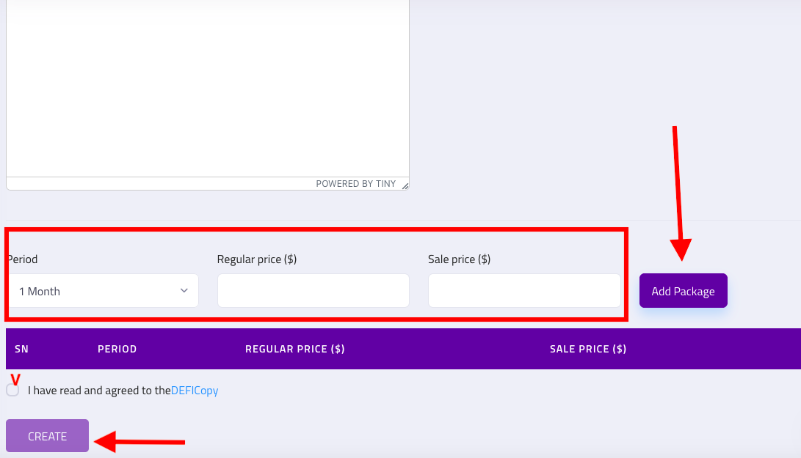

# Become a alert trader

### 1. you go to your product menu---> alert trading---> add new package&#x20;

### 2. New package ---> add Binance API OR Other Exchange APIs

### 3. You choose the monthly, quarterly, and annual sales price

### 4. Live chat with technical support to check your API connection. This takes 24-72h to test your API working. And then check if your trading signals are effective to sell signals in our system or not


normally you get profit share on your signal which is 20-40% depending on how effective your signal is through API we will decide it.&#x20;


