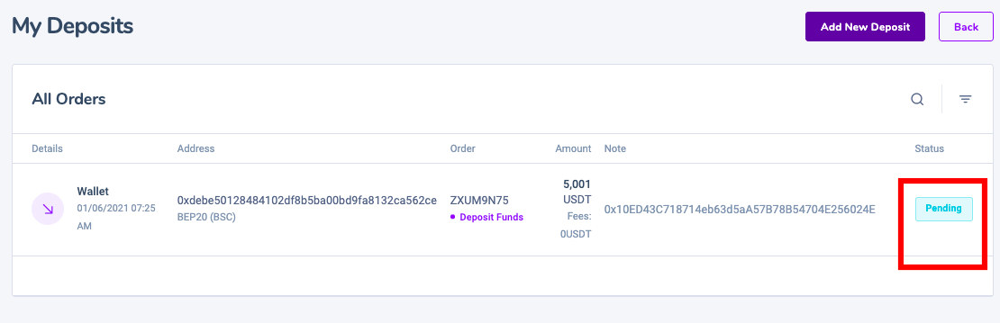

# Deposit

### How to Deposit Crypto on Defi Copy 

1. You go to the financial section in the menu--->history---> 

2\. add new deposit 

3\. you need to enter the correct amount you want to deposit in deficopy. 

                         \--->Please   usdt wallet address where you withdraw money correctly. 


Copy the deposit address provided by Deficopy  and paste it on the corresponding platform’s address section (where you intend to withdraw your funds from).




**Be careful!**

* The network selection depends on the options provided by the external wallet/exchange that you are making the withdrawal from.
* If the external platform only supports ERC20, you must select the ERC20 deposit network.
* **DO NOT select the cheapest fee option.** Select the one that is compatible with the external platform.
* For example, you can **** only send ERC20 tokens to another ERC20 address, and you can only send BSC tokens to another BSC address. **If you select incompatible/different deposit networks, you will lose your funds.**




**Be careful! If you select the wrong network, you will lose your funds.Summary of network selection:**

* BEP2 relates to the Binance Chain.
* BEP20 relates to the Binance Smart Chain (BSC).
* ERC20 relates to the Ethereum network.
* OMNI refers to the OmniLayer that runs on the Bitcoin network.
* TRC20 relates to the TRON network.
* BTC refers to the Bitcoin network.


4\. Please confirm if you have done everything correctly.

5\. If there is a pending command like the image below, you do it all right

6\. Please go to the overview to check if the USDt you loaded is available or not and you can start copying trading already.

After confirming the withdrawal request, you have to wait until the transaction is confirmed. The confirmation time varies depending on the blockchain and its current network traffic.Please, wait patiently for the transfer to be processed. The funds will be credited to your Deficopy  account shortly after
