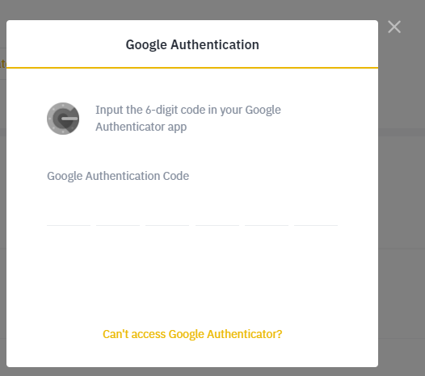

# Connecting exchanges, APIs

### Why do I have to connect an exchange?

To trade and copy, Defi Copy has to have access to your exchange account. This is done using API connection, which you can set up on Binance.

## Can I copy a trader without connecting an exchange?

Sorry, it's not possible. To be able to copy a trader, you have to connect your exchange account to your Defi Copy account. You can still follow a trader manually without connecting an exchange by turning on 'Follow'.

## How do I connect my Binance account?

Navigate to your profile icon at the top right corner of the screen. Click My Profile and My Exchanges.&#x20;

Give a name to your API access (for example 'Binance Trading Account')

Choose Binance as the exchange you want to connect with.

To fill out the 'API key' and 'API secret' fields, you have to navigate to your cryptocurrency exchange (Binance.com for now) and log in to your account.

After you logged in, navigate to your profile icon at the top right corner of the screen. On the hover menu click 'API Management'

Under 'Create new API' give a name to your connection (for example:  Defi copy) and click 'Create'.

Due to security reasons, you have to authenticate yourself again. Also, Binance will send you a confirmation e-mail where you have to confirm your intent.

Once you have confirmed the e-mail you will see a screen with all the data that you need to connect with deficopy.net&#x20;

Copy your 'API key' here and paste it into 'API key' field on deficopy.net . Copy your 'Secret key' and paste it into the 'API secret' field on deficopy.net . Click 'Save' on deficopy.net .Your exchange connection is now ready.&#x20;

To trade or copy on deficopy.net , you have to check 'Enable Trading' under API restrictions. You can keep all the other restrictions disabled.&#x20;

What is an API key?

An API key is used by a lot of online services, like cryptocurrency exchanges to provide a form of access control. The keys are linked to the identity of the user and provide certain rights for third-party services (like the right for Copy to access and make trades with your account)

## Does Defi Copy have access to my exchange account?

To trade and copy, you need to connect your exchange account to your Defi Copy account. This means that Defi Copy  will have access to the trading functions on your exchange account. Unless you choose to, Defi Copy **will not have any access to any withdrawal functions** from your exchange account.&#x20;
