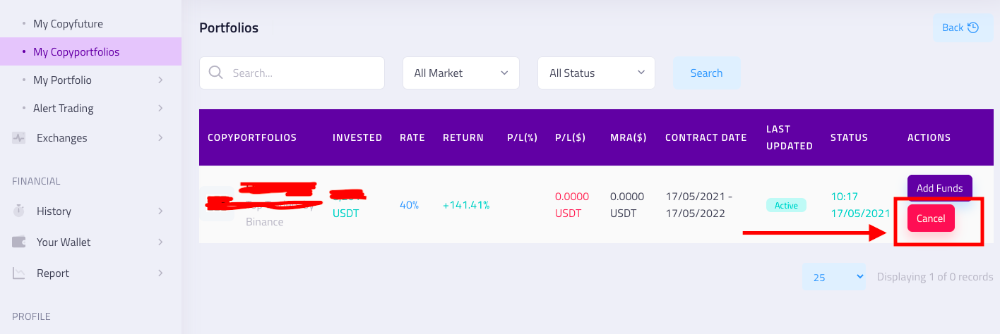

# Copying

### What does 'copying' mean?

‌By copying a trader, your account will automatically execute the trader's trading activity. In order to copy a trader, you have to connect your exchange account (currently Binance is supported) to your Deficopy  account.&#x20;

‌All the trades coming from the trader will be executed automatically on your end. You will be asked to specify the percentage of your portfolio you want to allocate for copying. The amounts for the copied trades will be calculated proportionately

## Can I copy more than one trader?

Yes. You can copy as many traders as you want. You can allocate your capital for each trader separately

## How do I stop copying somebody?

Navigate to the "My Copyportfolios " on the left side menu

You can see a list of traders that you are currently copying. Choose your trader you want to stop copying and click cancel .

## How do I allocate more/less money on copying a trader? 

Navigate to the right side menu and click My Copyportfolio&#x20;

Choose your trader and click ADD FUND&#x20;

