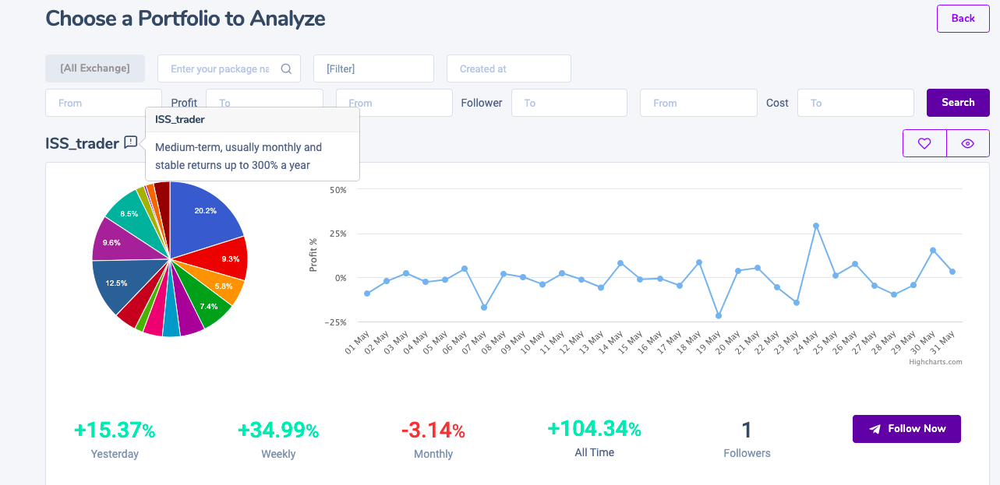

# Following

## What does 'following' mean?

‌By following a trader you can see the trader's trading activity and history. You can manually follow his trades by posting them on Defi Copy or your exchange of choice. You will also able to see when a trader opens, closes or modifies positions. In order to follow a trader, you don't need to connect your exchange account and there is no automatic execution of trades.

Following will be availabe in Q2 2021.

