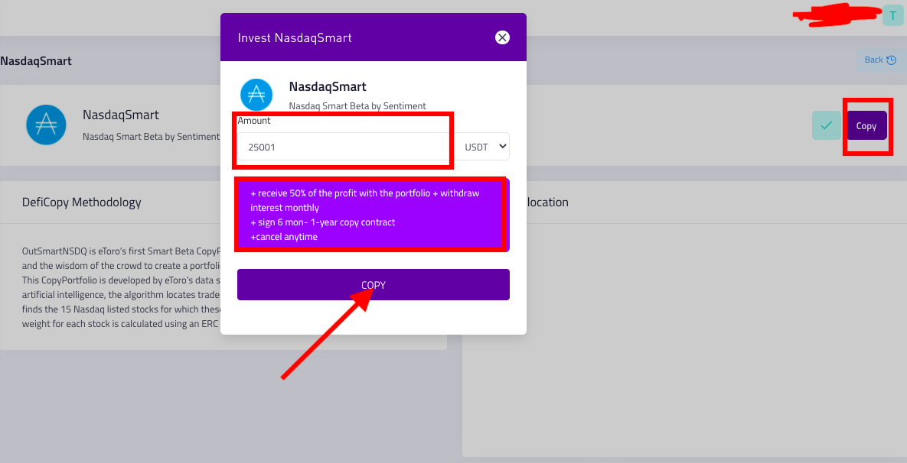

# Find master trader and copytrade

### 1. find a master trader you want to copy. Product-Copyportfolio

### 2.Please type in the search box the name of the trader you want to search

### 3. for example you want to find NasdaqSmart --->&#x20;

### 4. You can click the top right corner to see the performance

### 5.you can see monthly profit, invested amount and total number of investors

### 6. you click on Copy and  the amount you want to copy and read the 1-year commitment contract and then click copy and you're done.

### 7. you can see your contract here and its expiration date. Your products--->my copyportfolio

### 8.  you see details of profit, deposit, withdrawal, transfer, commission, everything here. Report--->balance logs&#x20;

