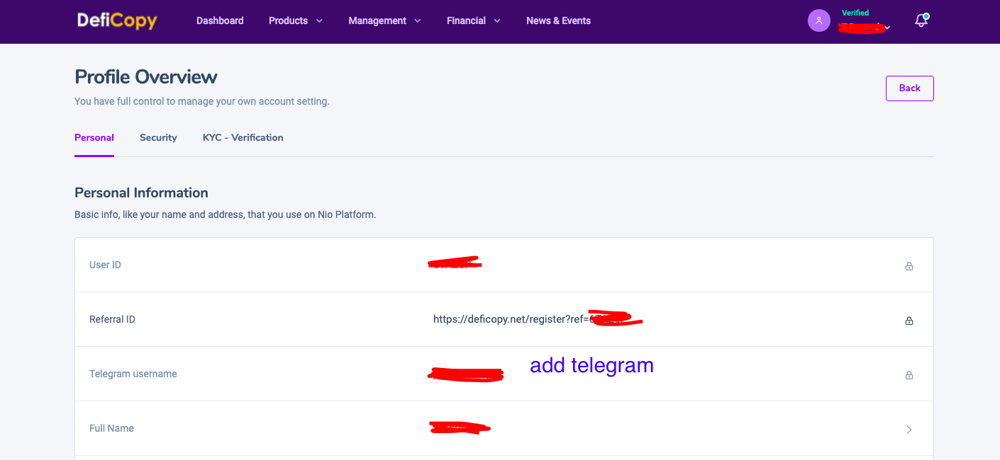
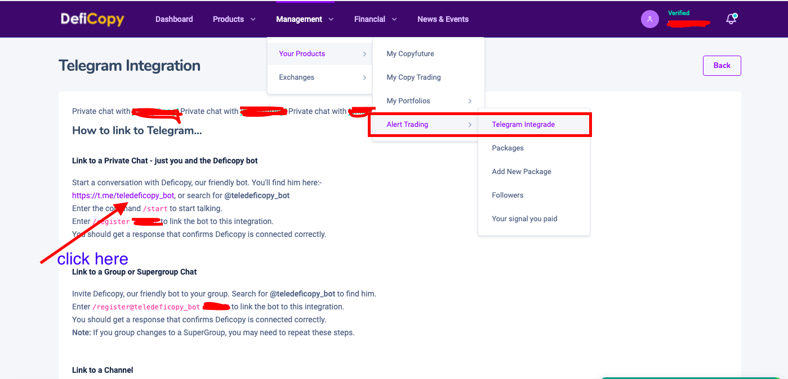
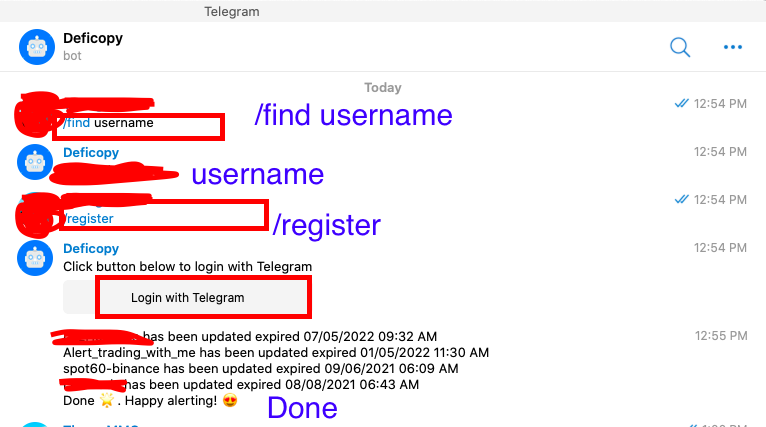
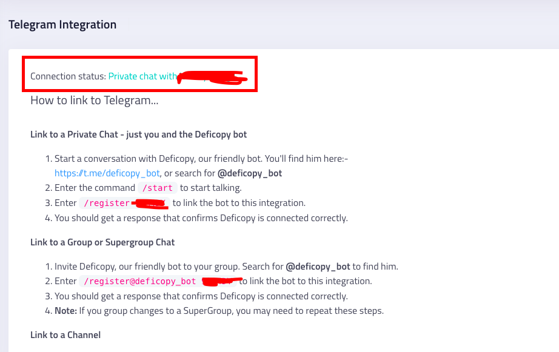

# Integrated telegram

### you want to integrate telegram to receive alerts into the application--->click here below&#x20;

1. ADD Telegram username&#x20;

#### 2. Click here&#x20;

.png>)

### 3. You  click ok and Click link [https://t.me/teledeficopy\_bot](https://t.me/teledeficopy\_bot)

### 4. Open Telegram or send message&#x20;

### &#x20;5. Enter the command /start to start talking.

### 6.you type /find username  in the chat box of telegram application then press enter.&#x20;

### 7.YOU  type /register in the chat box of telegram application then press enter.&#x20;

### 8. You click Login with telegram --->  connect telegram to web browser---> allow&#x20;

### 9. It's done for you&#x20;

### ou go back to the marketplace and there is no telegram link. It's done.&#x20;

