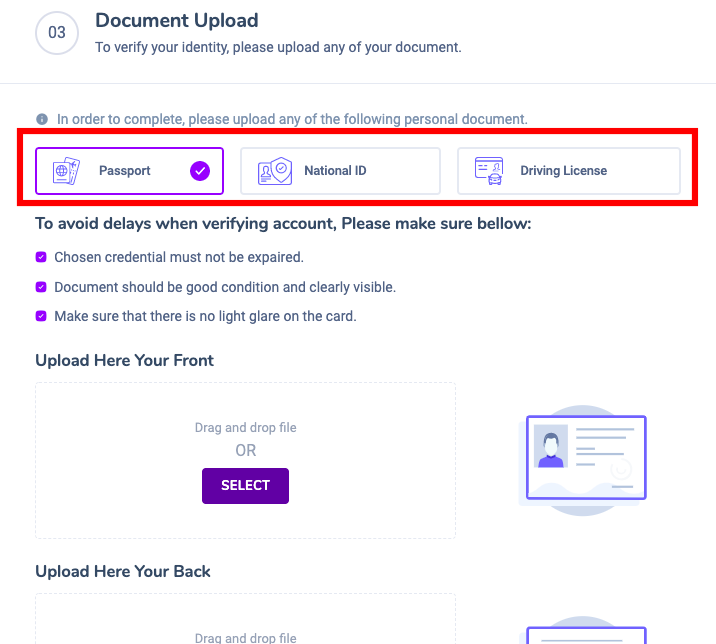

# KYC

### To make deposits and withdrawals you need to KYC

1. you need to go to the menu of account setting

2\. click on KYC Verification , then click here to complete your KYC&#x20;

3\. Fill in all required fields with a red asterisk

4\. Fill in the fields with your address information

5\. choose one of 3 types of documents that verify your identity

6\. you choose to upload the front and back of your ID to complete

7\. Congratulations on your successful kyc verification. Experience the complete system

