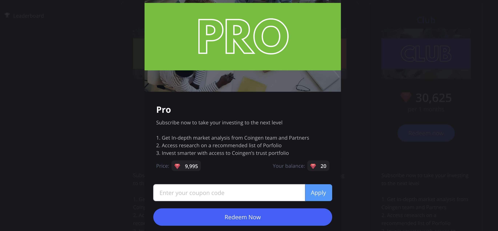

# 🚼 New Releases and Change Log

## 18.0.0-2022-08-03

### 18.0.01: Make home page interface with new interaction

### 18.0.02: Develop analysis feature of key indicators a coin and token

### 18.0.03 : Developed coin and token comparison feature

### 18.0.04: Economic Calendar&#x20;

## 17.0.0 - 2022-07-19

### 17.01 Updated package for user : Live, pro, Club ranking&#x20;

### 17.02 : Redeem  gems to buy advanced features&#x20;

### 17.03: Daily blog updates from top 100 newspapers

### 17-04: Cooperate with hundreds of researchers to publish articles, reports, research to coingen

## 16.0.0 - 2022-06-25

### Updated&#x20;

Coingen's roadmap in June 2022

### Changed&#x20;

business Model&#x20;

Use case GEM Point &#x20;

## 15.0.0 - 2021-05-31

### Fixed

fixed security&#x20;

### Changed

KYC - Verification

## 14.0.0 - 2021-03-06

### Added

* Google Authentication
*   **SMS Authentication**

    Used for withdrawals and security modificationsEnable
*   **E-mail Address**

    Used for withdrawals and security modifications
*   **Save my Activity Logs**

    You can save your all activity logs including unusual activity detected
* Address Management
*   **Change Password**

    Set a unique password to protect your account
*   **Recent Activity**

    This information about the last login activity on your account\
    .

