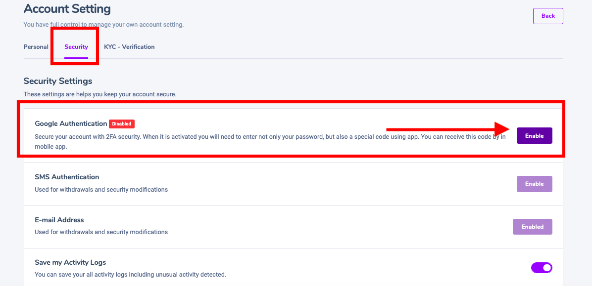
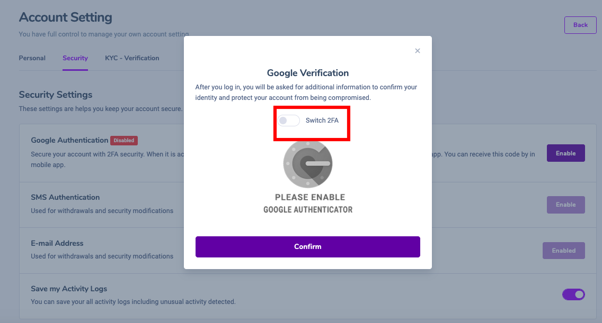
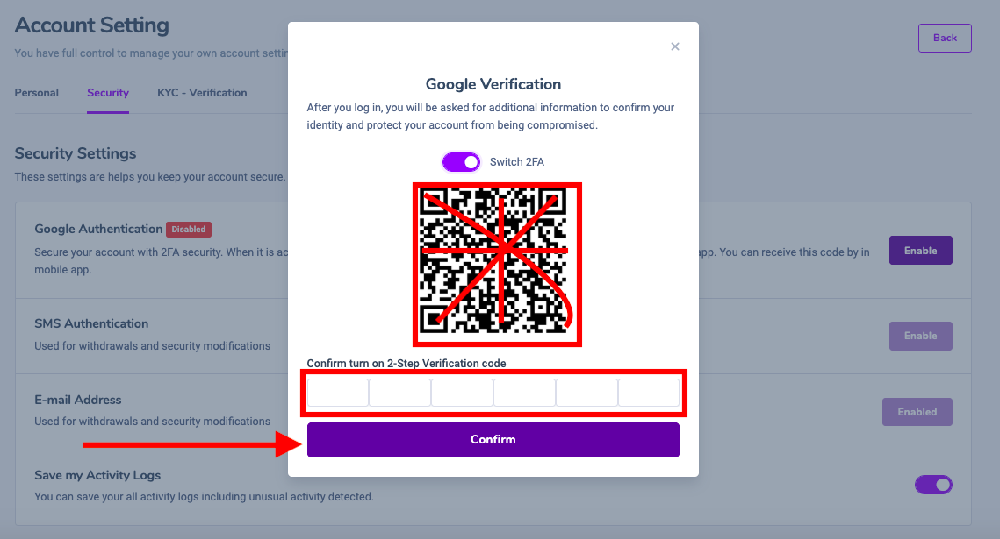
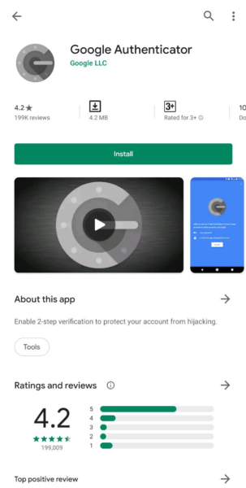
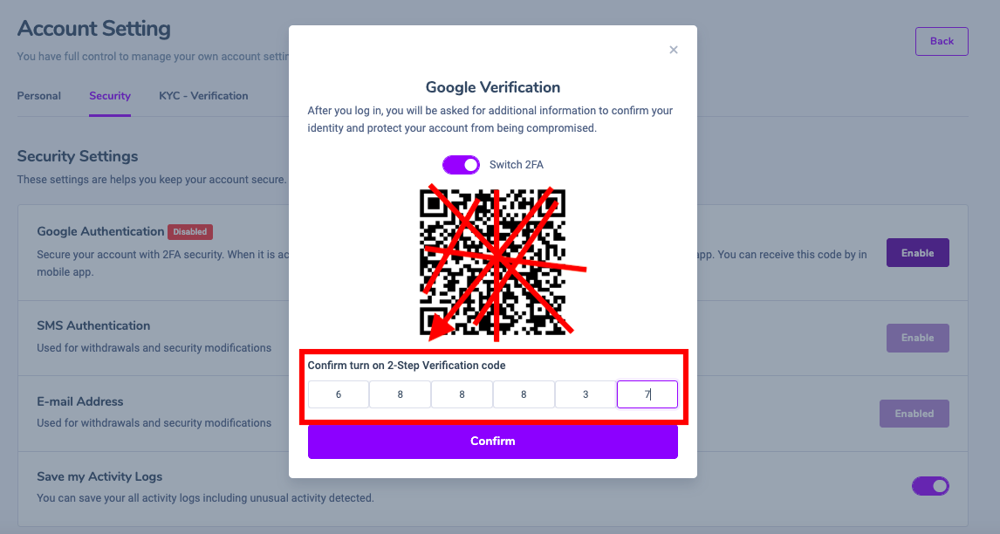
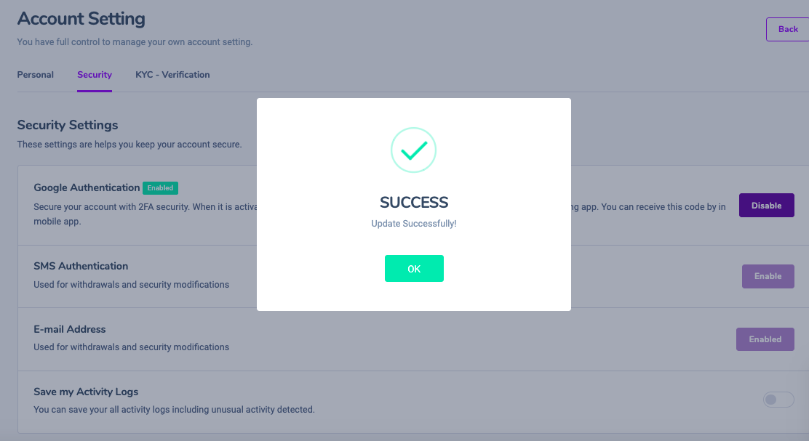

# Secure your account with 2FA security

1. you need to go into account setting--->security ---> Enable&#x20;

2\. you must enable 2fa code scanning mode--->

3.After the 2fa code appears in the form of a QR code, you need to open the Google Authenticator app to scan this QR code.

4\. download 2fa software  like the logo below

5\. After the installation is complete, click the plus sign at the top right of the menu then click on scan barcode&#x20;

&#x20;                   you use the phone camera to put up the place with the QR  code to scan.&#x20;

6\. When successful, it shows 6 automatic numbers as shown in the picture. You need to correctly fill in 6 numbers automatically in 30 seconds if you want to work in the 6-digit box in the table and press the confirm button

7\. you have successfully scanned the code 2fa

