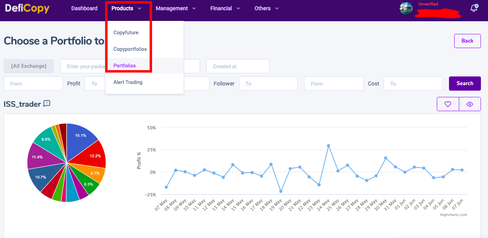
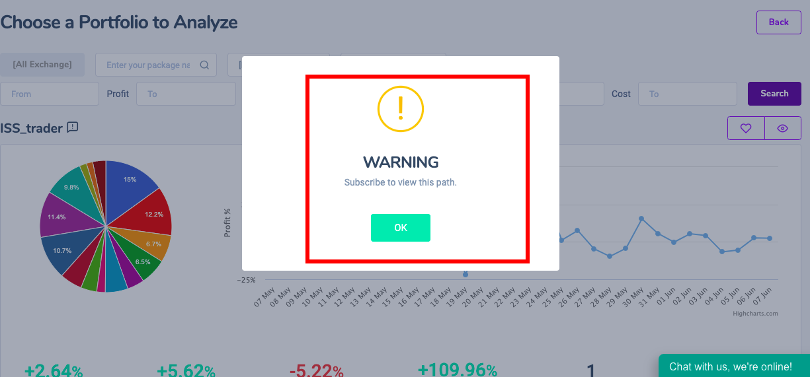
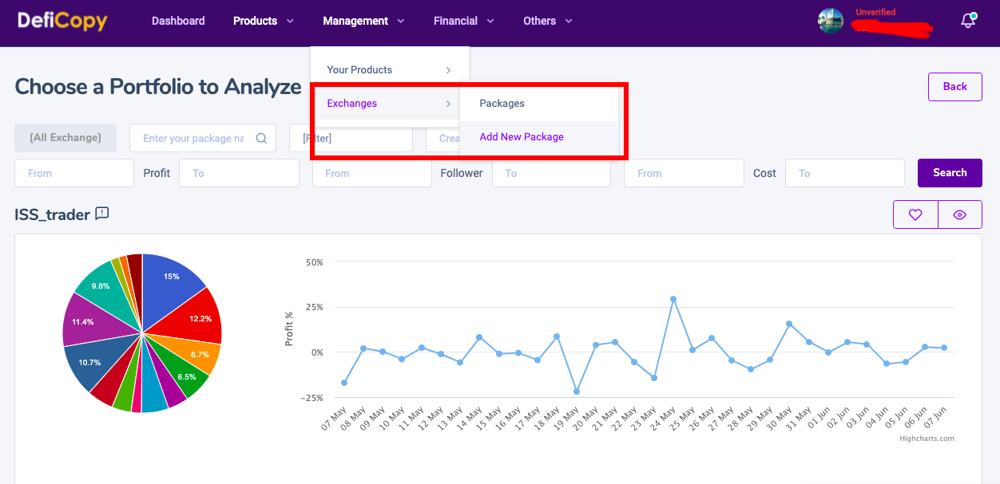
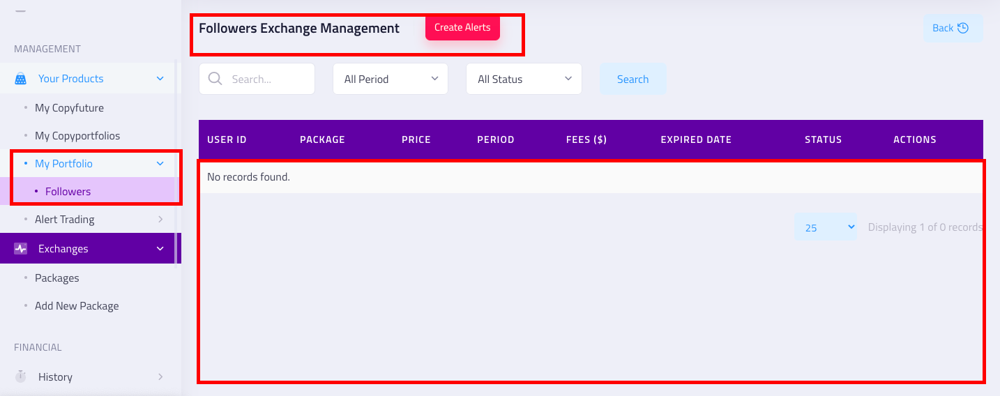

# Shared portfolio holds potential

### Portfolio sharing not only helps  earn an extra profit, but also helps a lot of new people to access the market in the fastest way

### Your portfolio cannot be viewed by others unless they have purchased a monthly subscription fee

### you get an average return of 20-40% in a portfolio that you share with others. Very humane, isn't it, you make money, so do other people

### you can share a portfolio when you connect the exchange api binance, huobi, coinbase...

### Please copy the API address of the exchange exactly, to ensure the data is shared in real time


and now you can earn passive income with your portfolio forever


### you check the number of people, the amount of money earned following your category here.

