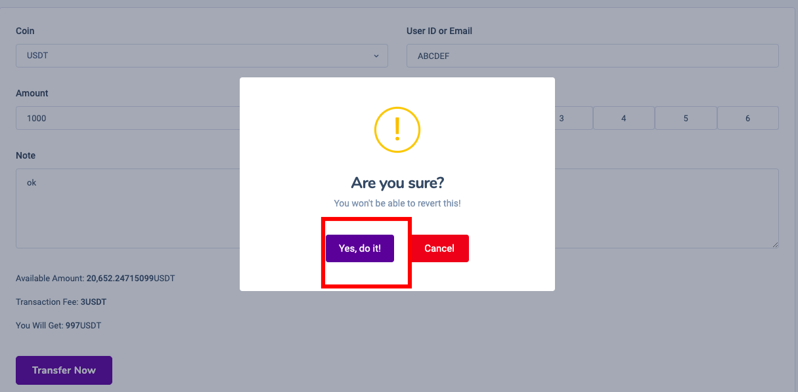

# Transfer

1. You choose to enter your financial area --->history--->transfer&#x20;

.png>)

2\. Add new transfer&#x20;

.png>)

3\. please remember to copy the correct UID or email or you will lose money.&#x20;

.png>)

4\. Confirm Yes do it.&#x20;

