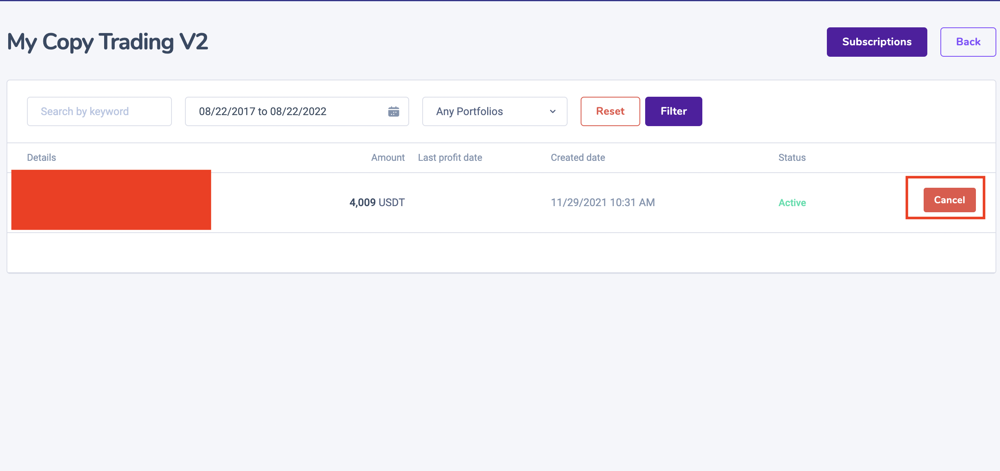
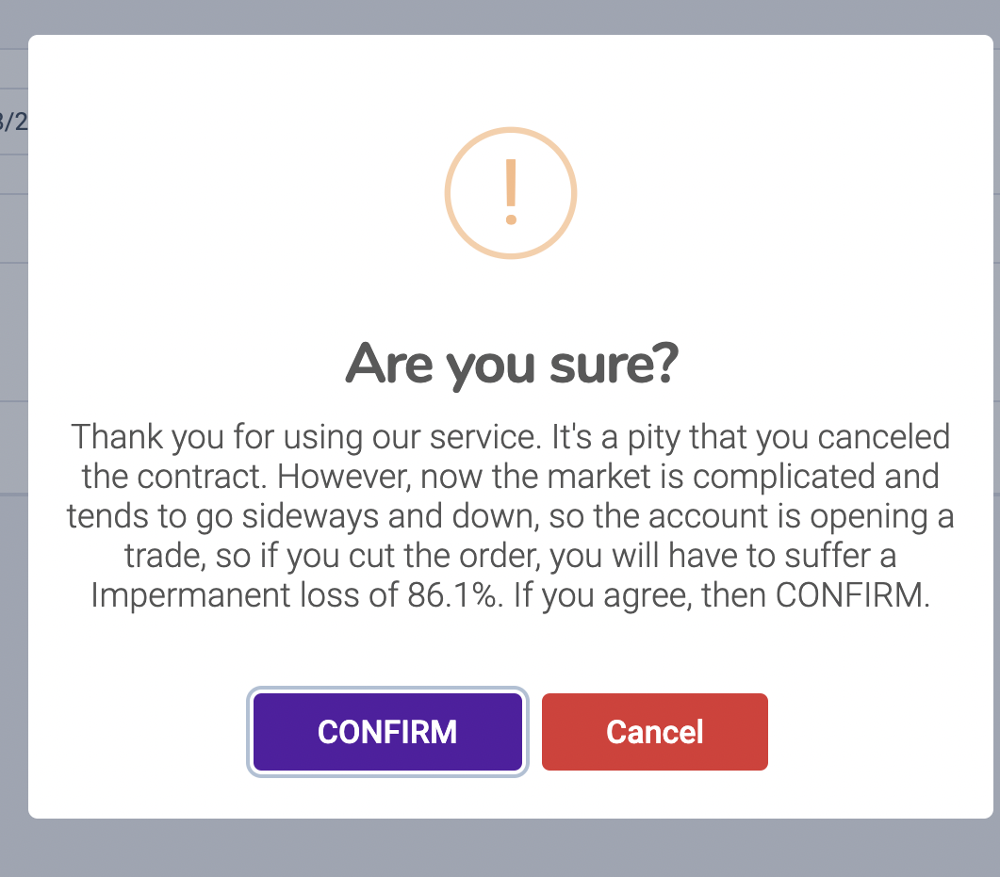

# Cancel contract

### 1. Log into your Coingen.net/login  account and go to [https://coingen.net/user/financial/copytrading](https://coingen.net/user/financial/copytrading)

### 2. confirm cancel contract&#x20;

.


**Warning!** If you input the wrong information or select the wrong network when making a transfer, your assets will be permanently lost. Please, make sure that the information is correct before making a transfer.


