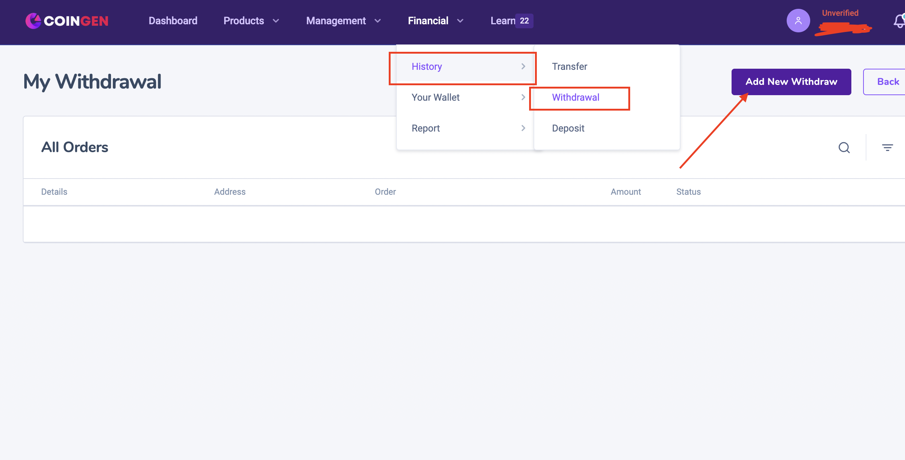
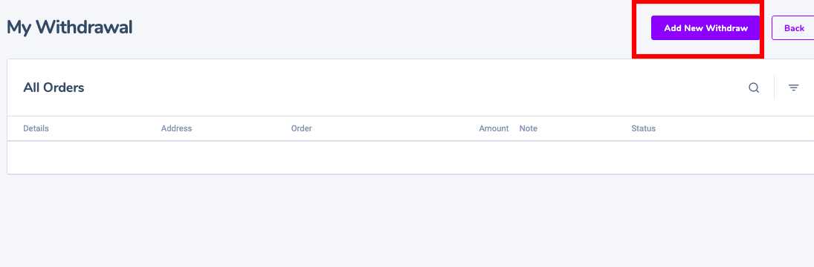
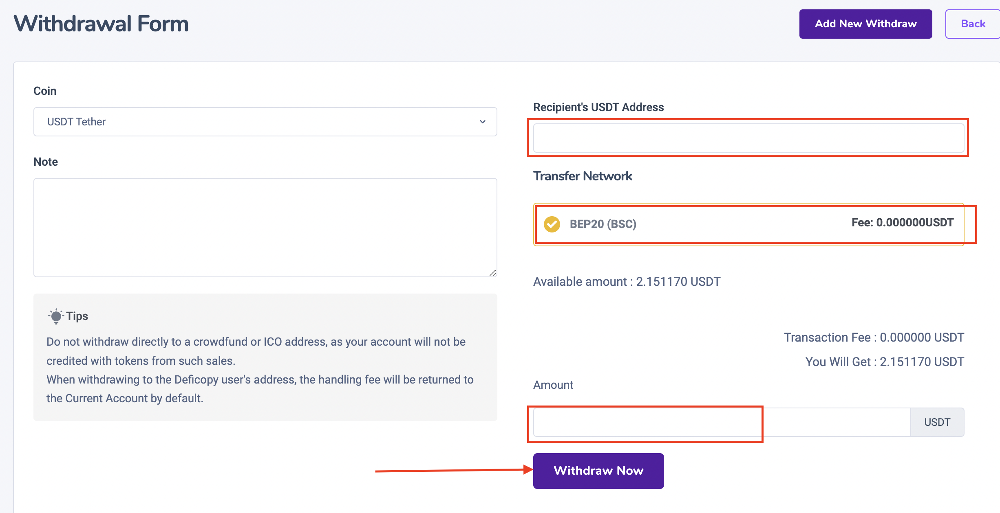
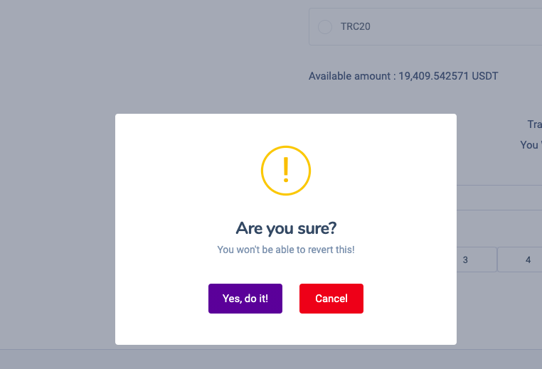

# Withdraw

### 1. Log into your Coingen.net/login  account and go to financial --->history--->withdrawal ( [https://coingen.net/user/financial/withdrawal](https://coingen.net/user/financial/withdrawal))&#x20;

2\. add new withdraw&#x20;

### 3. Select the cryptocurrency you want to withdraw. In this example, we will withdraw USDT&#x20;

Enter the withdrawal \[Amount]. At this point, you will be able to see the corresponding transaction fee and the final amount. Click \[withdraw now ] when you are ready.


1. you need to copy the usdt wallet address of binance, huobi, or another wallet that can hold usdt.&#x20;
2. you need to consider withdrawing which network suitable for your usdt wallet can support. Otherwise you may lose money.
3. Amount: amount you want to withdraw
4. you need to fill the code 2fa in 30 seconds.
5. withdraw now&#x20;


### 4. Please confirm the correct withdrawal


**Warning!** If you input the wrong information or select the wrong network when making a transfer, your assets will be permanently lost. Please, make sure that the information is correct before making a transfer.


